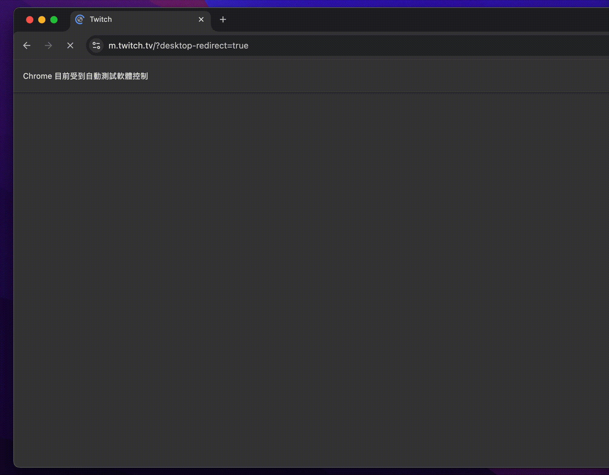

# Home Automation Test

## Overview
This project is a simple automation test for Twitch using Python, Selenium, and pytest.

A basic user flow:
- Open Twitch mobile mobile emulator from google chrome selenium
- Go to Twitch
- Click the search icon and search for "StarCraft II"
- Scroll down 2 times
- Select one streamer
- Wait for the streamer page to load
- Take a screenshot
---

## Tech Stack
- Python
- Selenium
- Pytest
- Mobile Emulation (google chrome selenium)

---

## Project Structure
```bash
.
├── pages/
│ ├── base_page.py
│ ├── home_page.py
│ ├── search_page.py
│ └── streamer_page.py
├── tests/
│ └── test_twitch.py
├── screenshots/
├── conftest.py
├── pytest.ini
├── requirements.txt
└── README.md
```

---

## Setup
```bash
python3 -m venv .venv
source .venv/bin/activate
pip install -r requirements.txt
```

## Run Test
```bash
pytest tests/test_twitch.py -v
```

## Notes
The test runs using Chrome mobile emulation.
A popup handling method is included for streamer pages if a modal appears before the video loads.
Explicit waits are used to improve test stability.

## Demo

